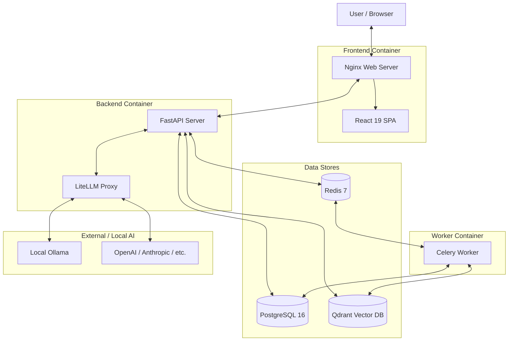
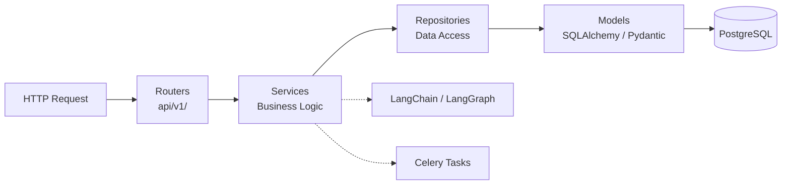
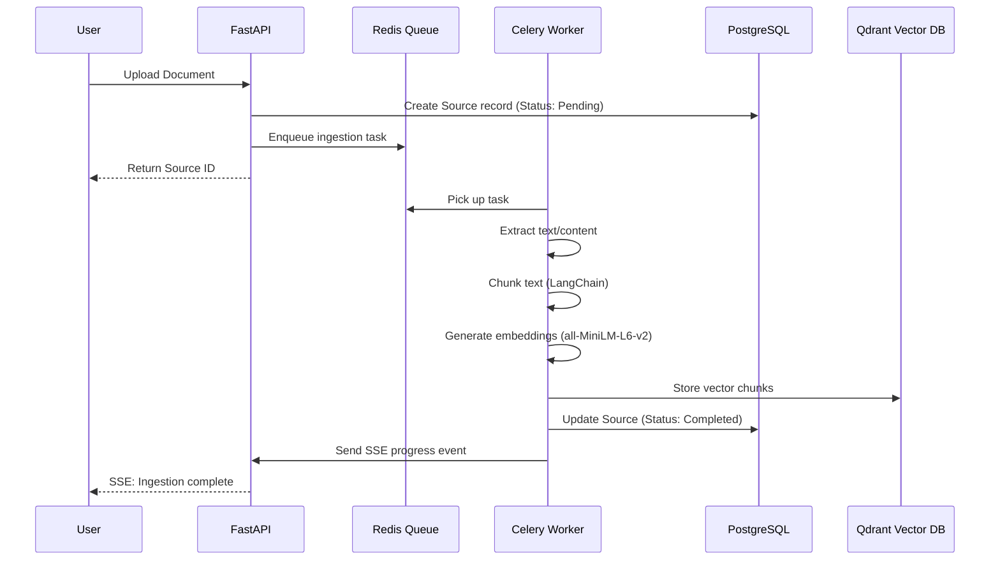
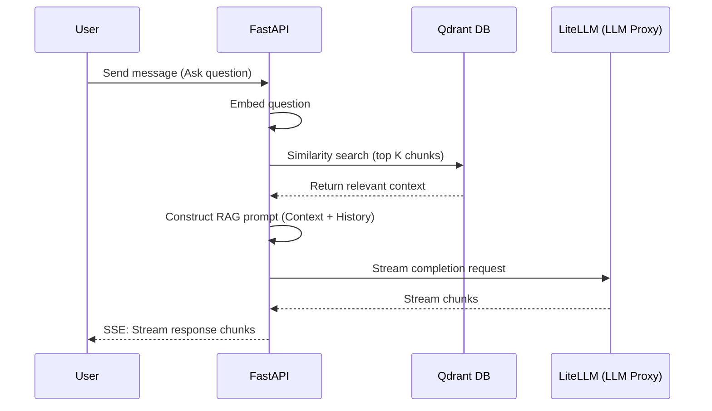
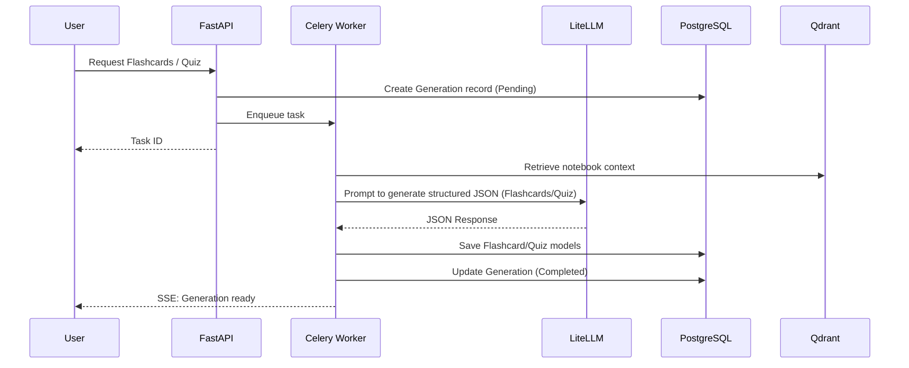
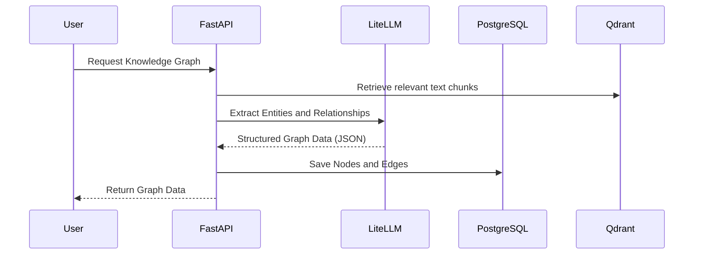

# Thinkora Architecture

Thinkora is an open-source, local-first AI-powered document chat application. This document outlines its architectural design, technical stack, and data flows.

## Table of Contents
1. [System Overview](#1-system-overview)
2. [Backend Architecture](#2-backend-architecture)
3. [Frontend Architecture](#3-frontend-architecture)
4. [Data Flows](#4-data-flows)
   - [Document Ingestion](#document-ingestion-flow)
   - [Chat / RAG Flow](#chat--rag-flow)
   - [Study Tool Generation](#study-tool-generation-flow)
   - [Knowledge Graph Generation](#knowledge-graph-generation-flow)
5. [Infrastructure](#5-infrastructure)
6. [Security Architecture](#6-security-architecture)
7. [Background Processing](#7-background-processing)
8. [Real-time Communication](#8-real-time-communication)
9. [Technology Decisions](#9-technology-decisions)

---

## 1. System Overview

Thinkora is built around a containerized microservices-style architecture deployed via Docker Compose.

---

## 2. Backend Architecture

The backend is built with Python 3.11+, FastAPI, and SQLAlchemy 2.0 (async). It follows a strict layered architecture: **Router → Service → Repository → Model**.

- **Router**: Defines API endpoints, validates inputs via Pydantic, handles HTTP responses.
- **Service**: Core business logic, orchestrates data flow, interacts with AI models and Celery.
- **Repository**: Encapsulates all database queries and interactions, abstracting SQLAlchemy details.
- **Model**: SQLAlchemy entities and Pydantic schemas for data representation.

---

## 3. Frontend Architecture

The frontend is a modern React application utilizing bleeding-edge libraries for performance and developer experience.

- **Framework**: React 19 + Vite
- **Styling**: Tailwind CSS v3 + shadcn/ui + Framer Motion
- **State Management**: Zustand (Global UI state)
- **Data Fetching**: TanStack Query v5 (Server state caching and synchronization)
- **Routing**: React Router v7
- **Specialized UI**: 
  - `@xyflow/react` for interactive knowledge graphs.
  - TipTap for rich-text editing (Notes).

---

## 4. Data Flows

### Document Ingestion Flow

### Chat / RAG Flow

### Study Tool Generation Flow

### Knowledge Graph Generation Flow

---

## 5. Infrastructure

The application runs locally or on remote servers via Docker Compose.

| Service | Image | Ports | Description |
|---------|-------|-------|-------------|
| **api** | Custom FastAPI build | 8000 | Core backend application server (Gunicorn + Uvicorn) |
| **worker** | Custom Celery build | - | Background task processor |
| **frontend** | nginx:alpine | 80 / 443 | Serves React static files and reverse proxies API |
| **postgres** | postgres:16-alpine | 5434 | Relational database (users, metadata, chats) |
| **redis** | redis:7-alpine | 6379 | Celery message broker and caching layer |
| **qdrant** | qdrant/qdrant:latest | 6333 / 6334 | Vector database for document embeddings |

> [!NOTE]
> During development (`docker-compose.dev.yml`), only infrastructure services (postgres, redis, qdrant) are containerized. The frontend and backend run natively for hot-reloading.

---

## 6. Security Architecture

- **Local-First Privacy**: Thinkora is designed to run entirely locally. Your documents and data never leave your machine unless you explicitly configure a remote LLM API (like OpenAI).
- **Authentication**: JWT-based authentication. Auth is optional and can be disabled via `AUTH_ENABLED=false` for frictionless local usage.
- **CORS**: Strictly configured in FastAPI (`CORS_ORIGINS`) to prevent unauthorized cross-origin requests.
- **Isolation**: Each notebook has a dedicated Qdrant collection, ensuring search queries do not leak context across different workspaces/notebooks.

---

## 7. Background Processing

Heavy tasks are offloaded to Celery workers using Redis as the broker.

**Task Types:**
- **Document Parsing**: Extracting text from PDFs, DOCX, TXT.
- **Chunking & Embedding**: Processing large texts into semantically meaningful chunks and generating local embeddings (`all-MiniLM-L6-v2` via `sentence-transformers`).
- **Batch AI Generation**: Generating study guides, timelines, or extensive knowledge graphs asynchronously to avoid HTTP timeouts.
- **Audio Overviews**: Synthesizing TTS audio using local (Kokoro) or remote providers.

---

## 8. Real-time Communication

Thinkora uses **Server-Sent Events (SSE)** extensively for real-time user feedback:
1. **Streaming LLM Responses**: Chat responses stream in real-time, providing a low-latency conversational experience.
2. **Task Progress Updates**: When documents are ingested or study tools are being generated, the Celery workers publish status updates to Redis, which the FastAPI server pushes to the React client via SSE.

---

## 9. Technology Decisions

- **FastAPI over Django/Flask**: Chosen for its native async support, automated OpenAPI documentation, and Pydantic integration, making it ideal for a modern API and streaming AI responses.
- **LiteLLM**: Provides a unified interface to interact with OpenAI, Anthropic, Gemini, Ollama, etc. This enables the "bring your own model" architecture without rewriting integration code.
- **Local Embeddings**: `all-MiniLM-L6-v2` is downloaded and run locally by default. This ensures document content isn't sent to a third party just for vector search.
- **Qdrant**: Selected for its speed, low memory footprint, and native Docker support.
- **React 19 + Vite**: Next-generation frontend tooling for immediate HMR and optimal build times.
- **TanStack Query + Zustand**: Clean separation of server state (Query) and client UI state (Zustand) prevents complex React context spaghetti.
